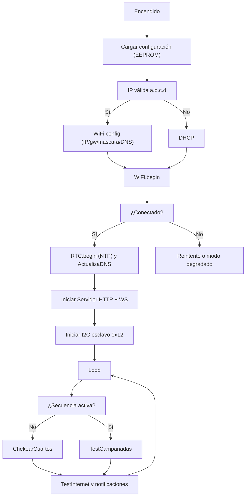
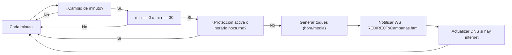
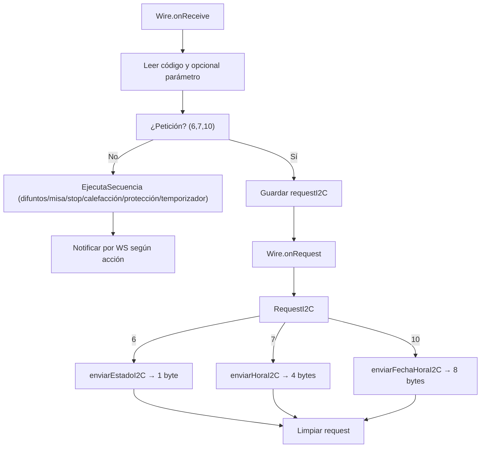
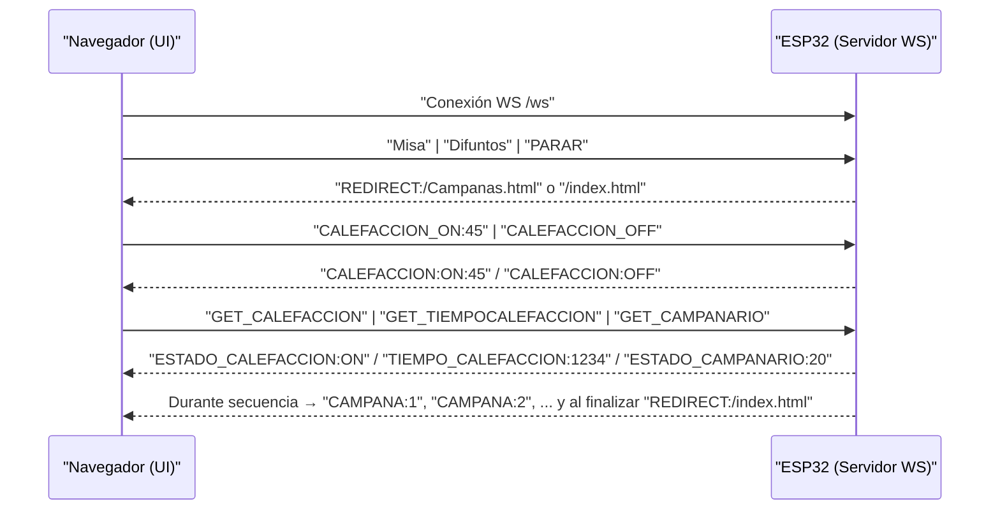

# Campanario (ESP32) — Documentación técnica

Este documento describe la arquitectura, los ficheros principales y los protocolos de comunicación (I2C y WebSocket) del proyecto Campanario. Sirve como guía para entender el funcionamiento y facilitar futuras modificaciones.

## Visión general

- Hardware: ESP32, 2 relés (campanas), 1 relé (calefacción), RTC por NTP.
- Conectividad: Wi‑Fi (IP estática o DHCP), servidor HTTP + WebSocket, portal cautivo para configuración.
- Entradas/salidas: Control de campanas por secuencias (misa/difuntos, horas y medias), calefacción con temporización.
- Protocolos:
  - I2C (esclavo 0x12) para órdenes y lecturas (estado/hora/fecha-hora).
  - WebSocket para control desde la UI web y notificaciones en tiempo real.

## Estructura de ficheros (carpeta Campanarios/)

- Campanarios.ino
  - Programa principal. Inicializa hardware (campanas, calefacción), Wi‑Fi, servidor, WebSocket e I2C. En el loop atiende las órdenes recibidas y las tareas periódicas: toques de horas/medias, temporización de calefacción y notificaciones.

- Auxiliar.h
  - Constantes, flags y funciones auxiliares del flujo principal.
  - Lógica de toques automáticos (ChekearCuartos): cada minuto detecta cambios; en punto (min 0) toca la hora; en min 30 toca la media; envía REDIRECT:/Campanas.html a clientes web y actualiza DNS si hay internet.
  - TestCampanadas: avanza la secuencia en curso, notifica "CAMPANA:<n>", gestiona fin de secuencia → REDIRECT:/index.html.
  - I2C: recibirSecuencia (lee comando y parámetro), enviarRequest (atiende peticiones de estado/hora/fecha-hora), enviarHoraI2C, enviarFechaHoraI2C, enviarEstadoI2C.
  - EjecutaSecuencia: ejecuta acciones según código (difuntos, misa, stop, calefacción on/off, protección, set temporizador) y notifica por WebSocket.
  - Utilidades: TestInternet (reconexión y notificación), EsHorarioNocturno, EsPeriodoToqueCampanas (protección ±5 min entorno a 00 y 30).

- ConexionWifi.h
  - ConectarWifi(ConfigWiFi, timeout): configura IP estática a partir de la IP completa "a.b.c.d" almacenada (si válida); si no, usa DHCP. Inicia Wi‑Fi, actualiza DNS con el dominio configurado y sincroniza RTC.

- ModoAP.h
  - Modo punto de acceso (AP) y portal cautivo DNS para configuración.
  - Estructura de configuración persistente en EEPROM:
    - struct ConfigWiFi { ssid[32], password[32], ip[16], dominio[32], usuario[32], clave[32] }.
  - Formulario HTML (htmlForm) servido en "/": solicita SSID, password, IP (4 octetos ip1..ip4), dominio, usuario y clave. El handler "/guardar" valida 0–255 por octeto, compone la IP "a.b.c.d" en configWiFi.ip y guarda con EEPROM.put.
  - iniciarModoAP(): levanta AP (SSID y clave definidos en el archivo), arranca DNS cautivo y servidor HTTP para mostrar/guardar configuración.

- Servidor.h
  - Servidor HTTP (AsyncWebServer) y WebSocket (ruta /ws). Sirve ficheros desde SPIFFS y protege rutas con autenticación básica.
  - procesaMensajeWebSocket(): interpreta mensajes entrantes y actúa (ver sección WebSocket).
  - Utilidades SPIFFS: listSPIFFS(), printFileContent().
  - hayInternet(): sondas HTTP 204 a Google para comprobar conectividad.

- DNSServicio.h
  - ActualizaDNS(dominio): realiza 2 peticiones HTTP GET (con autenticación básica) a servidores DNS para actualizar la IP asociada a un dominio. Muestra códigos y respuestas en modo depuración.

- Campanario.h / Campanario.cpp
  - Clase CAMPANARIO: administra campanas y calefacción, estados (bits) y secuencias.
  - Secuencias predefinidas (PROGMEM): difuntos y misa (como pasos que se despliegan a un plan de campanadas planas). Métodos de toque de horas/cuartos/media.
  - Temporización de calefacción: encendido con minutos, verificación de apagado automático.

- Campana.h / Campana.cpp
  - Clase CAMPANA: encapsula el pin del relé y el método de toque (impulso con duración fija).

- Calefaccion.h / Calefaccion.cpp
  - Clase CALEFACCION: enciende/apaga, almacena estado, controla temporizador y retorna segundos restantes.

- RTC.h
  - Interfaz para sincronización NTP y consulta de hora local: RTC::begin(), RTC::isNtpSync(). Usado por Auxiliar y ConexionWifi.

- data/
  - index.html: pantalla principal.
  - Campanas.html: visualización durante toques; recibe notificaciones WebSocket.
  - Campanas.js: lógica de UI (escucha /ws, acciones y redirecciones).

- DialCampanario/
  - Proyecto relacionado para un dispositivo dial (interfaz física). No forma parte del binario principal, pero comparte conceptos de estados/toques.

## Protocolo I2C

- Rol: el ESP32 actúa como esclavo en dirección 0x12 (SDA=21, SCL=22).
- Comandos admitidos (primer byte = código; opcionalmente un segundo byte = parámetro):
  - 1 (EstadoDifuntos): Inicia secuencia Difuntos. Notifica por WebSocket REDIRECT:/Campanas.html.
  - 2 (EstadoMisa): Inicia secuencia Misa. Notifica REDIRECT:/Campanas.html.
  - 3 (EstadoStop): Detiene la secuencia y notifica REDIRECT:/index.html.
  - 4 (EstadoCalefaccionOn): Enciende calefacción con minutos por defecto (nTemporizacionCalefaccion). Notifica CALEFACCION:ON.
  - 5 (EstadoCalefaccionOff): Apaga calefacción. Notifica CALEFACCION:OFF.
  - 6 (EstadoCampanario): Petición. El maestro debe leer respuesta mediante Wire: 1 byte con el estado actual (int reducido a byte).
  - 7 (EstadoHora): Petición. Respuesta: 4 bytes → [estado][hora][min][seg] (si no hay hora: 0xFF en campos de tiempo).
  - 9 (EstadoProteccionCampanadas): Notifica por WebSocket PROTECCION:ON/OFF (no cambia estado).
  - 10 (EstadoFechaHora): Petición. Respuesta: 8 bytes → [estado][día][mes][año2d][hora][min][seg].
  - 11 (EstadoSetTemporizador): Ajusta minutos de calefacción al valor del segundo byte (0–255). Enciende y notifica CALEFACCION:ON:<min>.

Notas:
- recibirSecuencia(numBytes) almacena comando en secuenciaI2C; si el comando es de petición (6,7,10) se traslada a requestI2C y se limpia secuenciaI2C. Luego enviarRequest() debe ser llamado para emitir la respuesta por I2C (Wire.write()).
- EnviarEstado/Hora/FechaHora usan RTC::isNtpSync() para decidir datos válidos; si no hay hora válida, se rellenan con 0xFF.

## Protocolo WebSocket (/ws)

Mensajes entrantes desde el cliente web (control):
- "Difuntos" → Inicia secuencia Difuntos y envía a todos: REDIRECT:/Campanas.html.
- "Misa" → Inicia secuencia Misa y envía REDIRECT:/Campanas.html.
- "PARAR" → Detiene la secuencia y envía REDIRECT:/index.html.
- "CALEFACCION_ON:<min>" → Enciende calefacción por <min> (0–120). Envía CALEFACCION:ON:<min>.
- "CALEFACCION_OFF" → Apaga calefacción. Envía CALEFACCION:OFF.
- "GET_CALEFACCION" → Responde ESTADO_CALEFACCION:ON|OFF.
- "GET_TIEMPOCALEFACCION" → Responde TIEMPO_CALEFACCION:<segundos> (double como string).
- "GET_CAMPANARIO" → Responde ESTADO_CAMPANARIO:<int> (bits de estado).

Notificaciones salientes (servidor → clientes):
- "REDIRECT:/Campanas.html" al iniciar secuencias o cada media/hora desde ChekearCuartos.
- "REDIRECT:/index.html" al finalizar una secuencia.
- "CAMPANA:<n>" cada toque individual durante una secuencia.
- "CALEFACCION:ON"/"CALEFACCION:OFF" y "CALEFACCION:ON:<min>" al controlar calefacción.
- "PROTECCION:ON"/"PROTECCION:OFF" al consultar/propagar estado de protección.
- "ESTADO_*" y "TIEMPO_CALEFACCION" como respuestas a peticiones GET_*.

## Estados y bits del Campanario

- Bits (ver Campanario.h):
  - 0x01 Difuntos
  - 0x02 Misa
  - 0x04 Hora
  - 0x08 Cuartos
  - 0x10 Calefacción
  - 0x20 Sin Internet
  - 0x40 Protección Campanadas

El método Campanario.GetEstadoCampanario() devuelve el entero con estos bits.

## Configuración Wi‑Fi y Portal cautivo

- AP del dispositivo (por defecto en ModoAP.h): SSID y contraseña definidos en constantes del archivo.
- Formulario en "/": SSID, Password, IP (ip1..ip4), Dominio, Usuario, Clave.
- Guardado en EEPROM (EEPROM_SIZE=256) con EEPROM.put(0, configWiFi).
- Conexión en arranque: ConectarWifi() parsea configWiFi.ip → a.b.c.d. Si válida, aplica WiFi.config(IP, gateway=a.b.c.1, máscara /24, DNS 8.8.8.8/8.8.4.4) y conecta a SSID/password. Si inválida, usa DHCP.
- Tras conectar: ActualizaDNS(dominio) y RTC::begin().

## Flujo principal (resumen)

1. Arranque: carga configuración (EEPROM), conecta Wi‑Fi (estática o DHCP), inicia servidor y WebSocket, prepara I2C.
2. Bucle: si no hay secuencia activa → ChekearCuartos (toques de hora/media y actualización DNS).
3. Siempre: TestCampanadas avanza secuencias y notifica; si calefacción ON, se verifica temporizador y se actualiza estado/WS.
4. I2C: cuando llega un comando, se ejecuta (secuencia/calefacción) o se atiende una petición (estado/hora/fecha-hora).
5. WebSocket: comandos desde UI web y respuestas/avisos a los clientes.

## Puntos de extensión

- Añadir nuevas secuencias: definir pasos PROGMEM en Campanario y exponer un nuevo código en I2C/WebSocket.
- IP estática avanzada: ampliar ConfigWiFi con máscara, gateway y DNS (char[16] cada uno) para usar valores específicos en WiFi.config.
- Seguridad Web: migrar a HTTPS inverso (proxy) o tokens si se publica en internet. Revisar credenciales en DNSServicio.h.
- UI Web: ampliar Campanas.html/Campanas.js con nuevos controles y estados.

## Referencias rápidas

- Dirección I2C esclavo: 0x12 (SDA=21, SCL=22)
- WebSocket: ws en "/ws" (AsyncWebSocket)
- Rutas HTTP: "/" → index.html (con autenticación), "/Campanas.html"
- Persistencia: EEPROM (offset 0)
- Carpetas web (SPIFFS): data/index.html, data/Campanas.html, data/Campanas.js

## Diagramas de flujo

### Flujo de arranque y bucle principal



### Flujo ChekearCuartos (toques automáticos)



### Flujo de atención I2C



### Flujo WebSocket (cliente web)




## Ejemplos de comunicación

### I2C (maestro ↔ esclavo 0x12)

- Iniciar Misa (sin lectura):
  - Write del maestro: `0x02`
  - Acción: comienza la secuencia de misa; WS: `REDIRECT:/Campanas.html`.

- Obtener estado (1 byte):
  - Write del maestro: `0x06`
  - Read del maestro: `0x10` (ejemplo: bit 0x10 = calefacción ON)

- Obtener hora (4 bytes):
  - Write: `0x07`
  - Read: `[estado, hora, min, seg]` → p.ej. `[0x14, 0x0E, 0x1E, 0x00]` = estado 0x10+0x04, 14:30:00

- Obtener fecha y hora (8 bytes):
  - Write: `0x0A`
  - Read: `[estado, dia, mes, año(2d), hora, min, seg]` → `[0x04, 12, 8, 25, 14, 30, 0]`

- Ajustar temporizador de calefacción (30 min):
  - Write: `0x0B 0x1E` (11, 30)
  - Efecto: enciende calefacción 30 minutos; WS: `CALEFACCION:ON:30`

Notas:
- Si no hay hora válida (sin NTP), los campos de tiempo se devuelven como `0xFF`.
- Los códigos 1,2,3,4,5,11 ejecutan acciones; 6,7,10 generan respuesta en `Wire.onRequest`.

### WebSocket

- Iniciar Difuntos:
  - Cliente → servidor: `Difuntos`
  - Servidor → todos: `REDIRECT:/Campanas.html`

- Parar secuencia:
  - Cliente: `PARAR`
  - Servidor → todos: `REDIRECT:/index.html`

- Encender calefacción 45 minutos y consultar:
  - Cliente: `CALEFACCION_ON:45`
  - Servidor → todos: `CALEFACCION:ON:45`
  - Cliente: `GET_CALEFACCION`
  - Servidor (a solicitante): `ESTADO_CALEFACCION:ON`
  - Cliente: `GET_TIEMPOCALEFACCION`
  - Servidor: `TIEMPO_CALEFACCION:2670` (segundos restantes, ejemplo)

- Estado del campanario (bits):
  - Cliente: `GET_CAMPANARIO`
  - Servidor: `ESTADO_CAMPANARIO:20` (ejemplo → 0x10 + 0x04)

## Mapa de bits de ESTADO_CAMPANARIO

| Bit | Valor | Significado              |
|-----|-------|--------------------------|
| 0   | 0x01  | Difuntos                 |
| 1   | 0x02  | Misa                     |
| 2   | 0x04  | Hora                     |
| 3   | 0x08  | Cuartos                  |
| 4   | 0x10  | Calefacción              |
| 5   | 0x20  | Sin Internet             |
| 6   | 0x40  | Protección Campanadas    |

Ejemplo: `ESTADO_CAMPANARIO:20` → 20 decimal = 0x14 → bits 2 (0x04) y 4 (0x10) activos.

## Apéndice: Pruebas rápidas

### WebSocket desde consola del navegador

Abre el navegador en la red del dispositivo y ejecuta en la consola:

```js
const ws = new WebSocket("ws://<IP_DEL_DISPOSITIVO>/ws");
ws.onmessage = (e) => console.log("WS:", e.data);
ws.onopen = () => {
  ws.send("GET_CAMPANARIO");
  ws.send("GET_CALEFACCION");
  // ws.send("Misa");
  // ws.send("PARAR");
};
```

### WebSocket con wscat (opcional)

```bash
wscat -c ws://<IP_DEL_DISPOSITIVO>/ws
> GET_CAMPANARIO
> CALEFACCION_ON:15
> GET_TIEMPOCALEFACCION
```

### I2C como maestro (Arduino/ESP32)

Ejemplo mínimo para leer hora (4 bytes) y estado (1 byte) del esclavo 0x12:

```cpp
#include <Wire.h>

void setup() {
  Serial.begin(115200);
  Wire.begin(); // como maestro

  // Solicitar hora (código 0x07) → leer 4 bytes
  Wire.beginTransmission(0x12);
  Wire.write(0x07);
  Wire.endTransmission();
  delay(10);
  Wire.requestFrom(0x12, 4);
  if (Wire.available() == 4) {
    uint8_t estado = Wire.read();
    uint8_t h = Wire.read();
    uint8_t m = Wire.read();
    uint8_t s = Wire.read();
    Serial.printf("Estado=0x%02X Hora=%02u:%02u:%02u\n", estado, h, m, s);
  }

  // Solicitar estado (código 0x06) → leer 1 byte
  Wire.beginTransmission(0x12);
  Wire.write(0x06);
  Wire.endTransmission();
  delay(10);
  Wire.requestFrom(0x12, 1);
  if (Wire.available()) {
    uint8_t estado = Wire.read();
    Serial.printf("Estado=0x%02X\n", estado);
  }
}

void loop() {}
```

## Rutas HTTP y autenticación

- "/" → index.html (protegido con autenticación básica).
- "/Campanas.html" → vista durante los toques (sin controles).
- "/ws" → WebSocket (AsyncWebSocket) para control/notificaciones.
- Modo AP:
  - "/" → formulario `htmlForm` para SSID/Password/IP/Dominio/Usuario/Clave.
  - "/guardar" → procesa POST y persiste en EEPROM.

Notas:

- El servidor sirve estáticos desde SPIFFS (carpeta `data/`).
- La autenticación básica aplica al índice; ajustable en `Servidor.h`.

## Configuración persistente (EEPROM)

Estructura guardada en offset 0 (ver `ModoAP.h`):

```cpp
struct ConfigWiFi {
  char ssid[32];
  char password[32];
  char ip[16];        // IPv4 completa "a.b.c.d" o vacío para DHCP
  char dominio[32];   // dominio DDNS a actualizar
  char usuario[32];   // user para servicio DNS
  char clave[32];     // password para servicio DNS
};
```

Puntos clave:

- IP estática válida activa `WiFi.config`; si no es válida → DHCP.
- Tamaños incluyen terminador `\0`; no sobrepasar al guardar.

## SPIFFS (ficheros web)

- `data/index.html` → UI principal (controles).
- `data/Campanas.html` → UI de seguimiento durante toques.
- `data/Campanas.js` → lógica del cliente (WebSocket y acciones).

Mantenimiento:

- Al cambiar estos ficheros, volver a subir SPIFFS con la herramienta correspondiente del IDE.

## Compilación y despliegue

Arduino IDE (recomendado según estructura actual):

- Placa: ESP32 (por ejemplo, ESP32 Dev Module).
- Subida del sketch: compilar y subir `Campanarios.ino`.
- Sistema de ficheros (SPIFFS/LittleFS): usar la herramienta de subida para `data/`.
- Esquema de particiones: el por defecto del core ESP32 suele ser suficiente; si los ficheros web crecen, usar esquema con mayor SPIFFS.

Notas:

- No hay `platformio.ini` en el repositorio; si se migra a PlatformIO, crear ese archivo y declarar dependencias.

## Dependencias y librerías

- Núcleo ESP32 para Arduino (board manager).
- Async: ESPAsyncWebServer y AsyncTCP (ESP32).
- DNSServer (para portal cautivo en modo AP).
- Wire (I2C), WiFi, EEPROM, FS/SPIFFS.

Sugerencia: fijar versiones estables de AsyncTCP y ESPAsyncWebServer para evitar rupturas.

## Registro y depuración

- Velocidad serie: típicamente 115200 baudios.
- Mensajes clave: conexión Wi‑Fi, actualización DNS, eventos I2C/WS, arranque/apagado calefacción, toques.
- Recomendación: añadir prefijos por módulo [WIFI], [I2C], [WS], [DNS] para filtrar fácilmente.

## QA manual (smoke test)

1) Arranque sin red disponible → debe ofrecer modo operativo básico; sin bloqueos.
2) Modo AP: mostrar formulario, guardar y persistir datos (rearranque y verificación).
3) Conexión Wi‑Fi: IP estática válida y DHCP.
4) WebSocket: enviar `GET_*`, recibir respuestas; probar `Misa`, `Difuntos`, `PARAR`.
5) Calefacción: `CALEFACCION_ON:<min>` y cuenta regresiva (GET_TIEMPOCALEFACCION).
6) I2C: probar 0x06, 0x07, 0x0A y 0x0B desde maestro.
7) Toques automáticos: simular hora/minutos o esperar cambio y verificar `ChekearCuartos`.
8) DNS: verificar que `ActualizaDNS` responde 200/OK o registrar error.

## Resolución de problemas (FAQ)

- No conecta a Wi‑Fi:
  - Ver SSID/Password; probar DHCP (dejar IP vacía) y revisar cobertura.
  - Comprobar que la IP estática pertenece a la red y no está duplicada.

- No responde el WebSocket:
  - Abrir consola del navegador; revisar errores de conexión.
  - Confirmar que el servidor HTTP está accesible (`/`).

- Hora `0xFF` por I2C:
  - NTP aún no sincronizado. Esperar a `RTC.begin()` o verificar conectividad.

- DNS no actualiza:
  - Revisar `dominio`, `usuario`, `clave`; comprobar respuesta y códigos HTTP en logs.

- Toques no suenan o se cortan:
  - Verificar pines y relés en `Campanario.h` y cableado físico (`Imagenes/Cableado.JPG`).

## Seguridad

- Autenticación básica en UI principal; evitar exponer el puerto HTTP sin protección adicional en internet.
- Almacenar credenciales de DNS con cuidado; evitar compartir binarios con datos reales.
- Si se publica en WAN, considerar proxy inverso con HTTPS y control de acceso por IP.

## Pinout y cableado (referencia)

- I2C: SDA=21, SCL=22 (ESP32 por defecto en este proyecto).
- Relés campanas y calefacción: consultar definición de pines en `Campanario.h`.
- Imagen de referencia: `Imagenes/Cableado.JPG`.

## Glosario

- ChekearCuartos: rutina que dispara toques de horas y medias.
- Secuencia: conjunto ordenado de toques para Misa/Difuntos.
- Protección: ventana en la que se inhiben toques para evitar solapes (±5 min).
- WS: WebSocket; canal en tiempo real entre UI y ESP32.

---

Mantenedores: actualiza este documento si se añaden comandos, ficheros o cambia el flujo general.